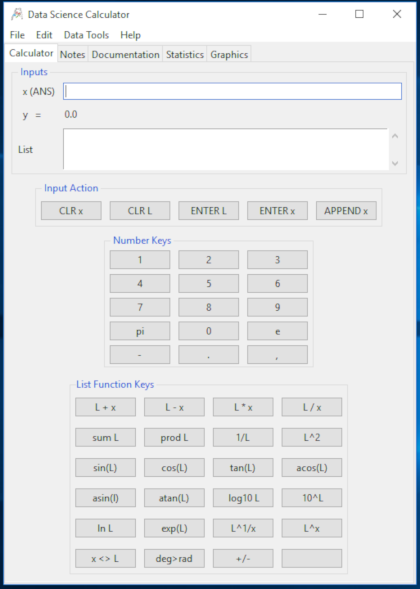

# DataSciCalc

A Data Science Calculator project in python
  
A programming project in python to implement with tkinter a simple data science calculator. This is another exercise but free for all to review and use if found helpful.Enjoy.

This is implemented with python 3.7, Tkinter Matplotlib and SciPy and is a work in progress. 

It is growing in functionality as new operations are added, increasingly from the numpy library. Plans are to add a function graphing capability via mathplotlib. I hope you follow allong and comment freely. Afterall, this is first and formost part of my learning experience.

I have tried to open my thinking process to view by including mind maps, doodles and UML models as I develop and grow this application. The screenshot for Version 0 / 1.25 is below.

## Motivation
  
There are lots of calculators. There are even GUI based analytics tools. But a Data Science tool with a calculator paradigm is at best rare. My practice with SciPy/numpy and Matplotlib is an opportunity to play with the paradigm for application of data science functionality. Thugh simple, it is not envisioned as a toy app. There are I think lots on opportunities for a quick pop-up solution in mono and bivaraiate situations. Lets see how it grows. Comments are encourages. Enjoy.

## Realization:

I have already practiced with Tkinter buidling a RPN Calculator, [SimpleCalc.](https://medmatix.github.io/SimpleCalc/) With this starting point the interface is re-worked to include various kinds of input, simple variable <entry>, sequence of python <List> oriented input and PANDAS dataframe oriented CSV file import input. From the the button and menu actions had to be revised to adapt actions to the kind of input targeted.
  
Initially I made an [interface sketch](https://github.com/medmatix/DataSciCalc/blob/master/GUI%20Layout%20Notes%20page_8.pdf) on graph paper.

Next, the Tkinter GUI from SimpleCalc was rewritten.

 
  
 
  
 

Finally the Code changes necessary to add list processing functionality to the basic calculator was undertaken. When completed the list elements were subject to the same functions being called for the list items, thus allowing the list data to be transformed in a simple way. More complex data munging being left for the Statistics section (tab4). See below for this discussion.

## Implementation

### Expansion from a Simple Calculator to Statistics Capable Tool: 
  
A simple caculator enhanced with list data capabilities, is expanded to a Data Science statistics aware tool manipulating and analyzing data in vector and matrix arrays. This marks the move to scipy/numpy capabilities for the Calculator paradigm.

#### Discussion:

### Enhancing the Interface and Help

An important part of usability is clarification of the interface and use documentation. As well an educational aspect is always welcome by student users but needs to be eaily bypassed for experienced users. This would include a fast look-up capability of even a more complete context sensitive help.

#### Discussion:

### The Statistical Interface

### The Graphics and Plotting Interface

