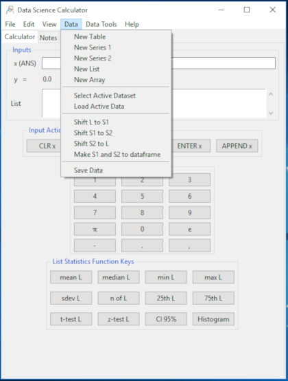
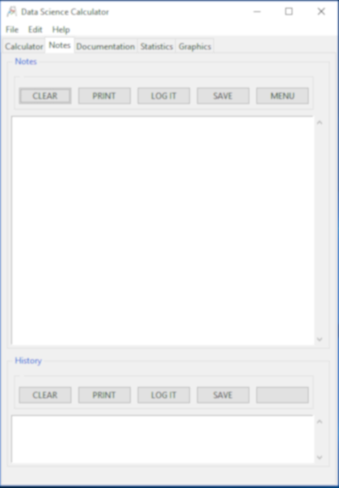

# DataSciCalc

A Data Science Calculator project in python
  
A programming project in python to implement with tkinter a data science calculator extending my earlier Simple Calculator. This is another exercise but free for all to review and use if found helpful.Enjoy.

This is implemented with python 3.7, Tkinter Matplotlib and SciPy and is a work in progress. 

It is growing in functionality as new operations are added, increasingly from the numpy library. Plans are to add a function graphing capability via mathplotlib. I hope you follow allong and comment freely. Afterall, this is first and formost part of my learning experience.

I have tried to open my thinking process to view by including mind maps, doodles and UML models as I develop and grow this application. The screenshot for Version 0 / 1.25 is below.

## Motivation
  
There are lots of calculators. There are even GUI based analytics tools. Ease of use varies a lot. But a Data Science tool with an intuitive calculator paradigm is at best rare. My practice with SciPy/numpy, Pandas and Matplotlib is an opportunity to play with the paradigm for application of data science functionality. Though simple, it is not envisioned as a toy app. There are I think lots on opportunities for a quick pop-up solution in mono and bivaraiate situations. Lets see how it grows. Comments are encouraged. Enjoy.

## Realization:

As I noted, I have already practiced with Tkinter buidling a RPN Calculator, [SimpleCalc.](https://medmatix.github.io/SimpleCalc/) With this starting point the interface is re-worked to include various kinds of input, simple variable <entry>, sequence of python <List> oriented input and PANDAS dataframe oriented CSV file import input. From the the button and menu actions had to be revised to adapt actions to the kind of input targeted.
  
Initially I made an [interface sketch](https://github.com/medmatix/DataSciCalc/blob/master/GUI%20Layout%20Notes%20page_8.pdf) on graph paper.

Next, the Tkinter GUI from SimpleCalc was rewritten.

 
  
 

 

Finally the Code changes necessary to add list processing functionality to the basic calculator was undertaken. When completed the list elements were subject to the same functions being called for the list items, thus allowing the list data to be transformed in a simple way. More complex data munging being left for the Statistics section (tab4). See below for this discussion.

## Implementation

### Expansion from a Simple Calculator to Statistics Capable Tool, and Beyond: 
  
A simple caculator enhanced with list data capabilities, is expanded to a Data Science statistics aware tool manipulating and analyzing data in vector and matrix arrays. This marks the move to scipy/numpy capabilities for the Calculator paradigm. By further extension adding Pandas Series and Dataframes would mark a jump to engage Data Science capabilities in the Calculartor paradigm. 

#### Discussion:
The data to be worked with is to start discrete as expected for the simple calculator function, as well as involving data lists, allowing univariate analyses to be brought in the the calculator. 

### Enhancing the Interface and Help

An important part of usability is clarification of the interface and use documentation. As well an educational aspect is always welcome by student users but needs to be eaily bypassed for experienced users. This would include a fast look-up capability of even a more complete context sensitive help.

#### Discussion:

### The Statistical Interface (Multivariate Statistics)
The Multivariate statistical interface continues the calculator paradigm. This functionality risks a much busier interface, a beginning challenge for this tab. Also this is (for now) where the dataset is selected and worked with primarily. With this tab, access to loading univariate data into the List variable is enabled.

### The Graphics and Plotting Interface
Where the introduction of data review with a historgram introduced a well procribed plot available in the univariate interface, more complex data visualization becomes available in the graphical tab. This applies the matplotlib functionality to the data we are accessing.

